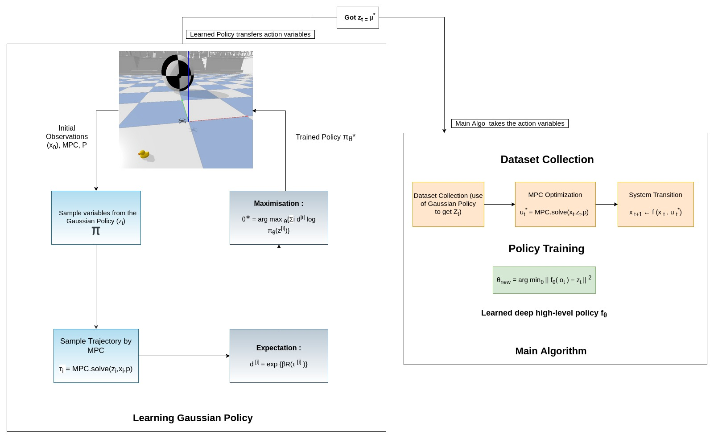
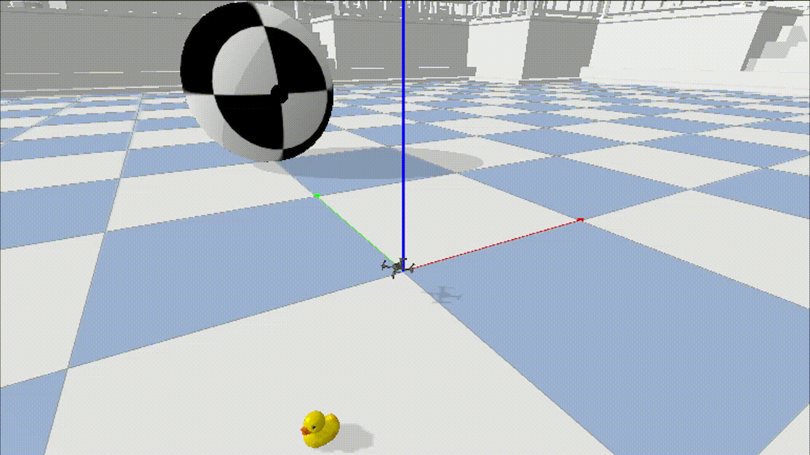

# Abstract : 
The combination of policy search and deep neural networks holds the promise of automating a variety of decision- making tasks. Model Predictive Control (MPC) provides robust solutions to robot control tasks by making use of a dynamical model of the system and solving an optimization problem online over a short planning horizon. Policy Search and Model Predictive Control (MPC) are two different paradigms for robot control: policy search has the strength of automatically learning complex policies using experienced data, while MPC can offer optimal control performance using models and trajectory optimization. An open research question is how to leverage and combine the advantages of both approaches.

# Introduction :
In practice, the closed-loop performance of MPC for a specific task is sensitive to several design choices, including cost function formulation,2 hyperparameters, and the prediction horizon. As a result, a series of approximations, heuristics, and parameter tuning is
employed, producing sub-optimal solutions. On the other hand, reinforcement learning (RL) [19] methods, like policy search, allow solving continuous control problems with minimum prior knowledge about the task. The key idea of RL is to automatically train the policy via trial and error and maximize the task performance measured by the given reward function. While RL has achieved impressive results in solving a wide range of robot control tasks, the lack of interpretability of an end-to-end controller trained using RL is of significant concern by the control community.
Ideally, the control framework should be able to combine the advantages of both methods—the ability of model-based controllers, like MPC, to safely control a physical robot using the well-established knowledge in dynamic modeling and optimization and the power of RL to learn complex policies using experienced data automatically. Therefore, the resulting control framework can handle large-scale inputs, reduce human-in-the-loop design and tuning, and eventually achieve adaptive and optimal control performance. Despite these valuable features, designing such a system remains a
significant challenge.

# Simulation and Packages:

For simulation I have <a href="https://github.com/utiasDSL/gym-pybullet-drones">gym-pybullet-drones</a> and for MPC, I have used <a href="https://github.com/locuslab/mpc.pytorch">MPC.Pytorch</a> provided by <a href="https://locuslab.github.io/mpc.pytorch/">LucasLab<a/>. The RL part is also done in Pytorch to decrease the training time by 1.46 times (as compared to tensorflow).

# The Algorithm :

Make both figure in one figure. With arrows or more dynamic look.. May be that makes it more good. Q

 <em>Overview of Algorithm in Brief</em>

 

## Detailed flow diagram of algorithm :
Since, this project is a three stage project.
<ol>
  <li>Make a single drone basic but responsive and easily and generalizable pipline.</li>
  <li>Make a swarm drone system where each drone is supported by such seperated trained RL polices.</li>
  <li>Make a hardware implementation of this project (This was the main reason behind using a easy to implement and learn algorithm)</li>
</ol>

 <em>Detail Flow diagram of Algorithm : The left side diagram represents learning of Gaussain Policy while the data collection process while right side represnts the whole Algorithm.</em>

 
  
# RL Policy (Under Policy Training in right side diagram)

 <em>Pictorial Representation for RL Policy used (not actual just representation)</em>

Since, it is a well known fact that big bulkier models are computationally expensive and easily suffer from overfit while the thinner models are hard to generalise, especially in the case of Multi Agent extension of this project. Therefore, it make sense to use a mid way of both. I have used a three Dense layers model with relu as activation as the Policy.

# Results : 

# Resources:

**[1.]** Y. Song and D. Scaramuzza, "Policy Search for Model Predictive Control with Application to Agile Drone Flight," IEEE Transaction on Robotics (T-RO), 2021. 
**[2.]** Y. Song and D. Scaramuzza, "Learning High-Level Policies for Model Predictive Control," IEEE/RSJ International Conference on Intelligent Robots and Systems (IROS), Las Vegas, 2020.  
**[3.]** Aravind Venugopal 1 , Elizabeth Bondi 2 , Harshavardhan Kamarthi 3 , Keval Dholakia 1 , Balaraman Ravindran 1 , Milind Tambe 2 Reinforcement Learning for Unified Allocation and Patrolling in Signaling Games with Uncertainty 
**[4.]** Baolai Wang , Shengang Li ,Xianzhong Gao ,and Tao Xie UAV Swarm Confrontation Using Hierarchical Multiagent Reinforcement Learning 
**[5.]** Brandon Amos, J. Zico Kolter OptNet: Differentiable Optimization as a Layer in Neural Networks 
**[6.]** Jacopo Panerati (1 and 2), Hehui Zheng (3), SiQi Zhou (1 and 2), James Xu (1), Amanda Prorok (3), Angela P. Schoellig (1 and 2) ((1) University of Toronto Institute for Aerospace Studies, (2) Vector Institute for Artificial Intelligence, (3) University of Cambridge) Learning to Fly -- a Gym Environment with PyBullet Physics for Reinforcement Learning of Multi-agent Quadcopter Control 
**[7.]** Brandon Amos, Ivan Dario Jimenez Rodriguez, Jacob Sacks, Byron Boots, J. Zico Kolter Differentiable MPC for End-to-end Planning and Control

# Future Work:
  
As mentioned above, this project is a long run project which is to be scaled upto multi agent system and it possible in hardwares too.
Any collaboration or PR will be highly appreciated.

